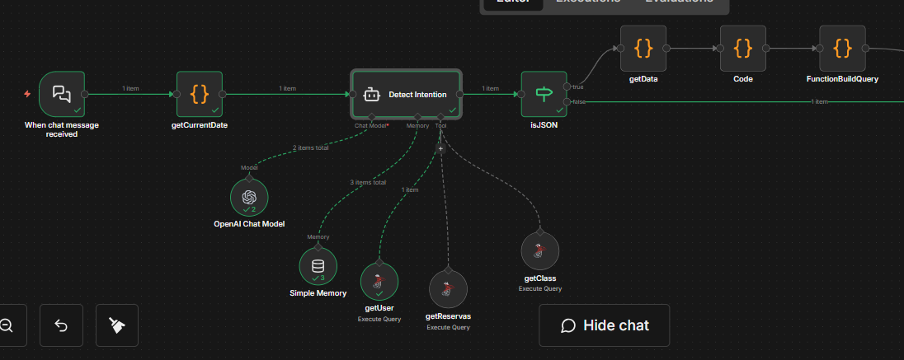
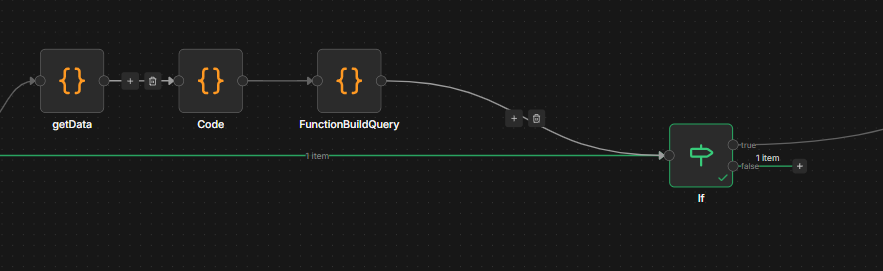
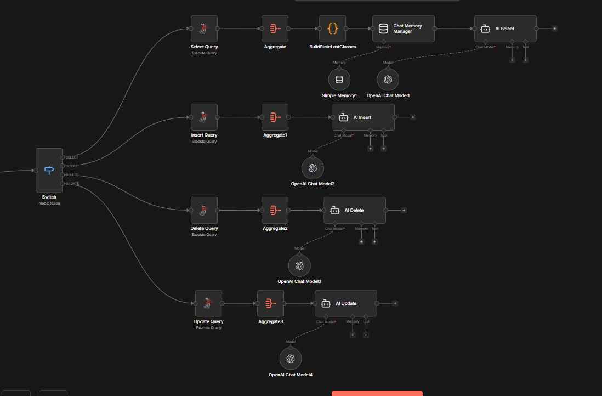

# n8n-SQL-WhatsApp

Portfolio project: an n8n workflow that automates gym class management through a WhatsApp-like chat.

## What it does
- Detects user intent (list / reserve / cancel / modify / view reservations)
- Validates the user before executing actions
- Keeps context using memory (e.g., last shown classes)
- Routes actions using a switch and executes SQL safely (transaction-based)

## Workflow diagrams

### 1) High-level flow

### 2) Parsing & routing

### 3) Action branches (select / insert / delete / update)

## Tech stack
- n8n
- SQL (classes + reservations)
- LLM (intent detection + structured output)

## Security note
This repository intentionally includes only workflow diagrams.
Prompts, credentials, connection strings, and production data are not included.
